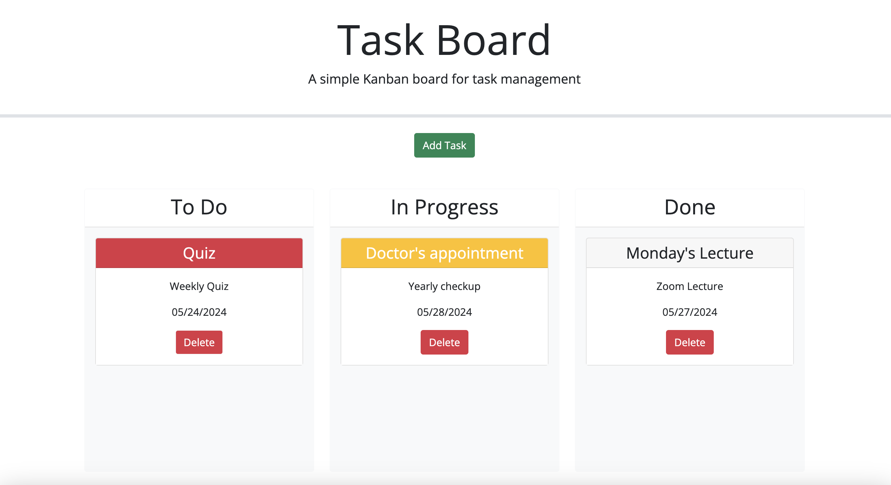

# Challenge 5 UC Berkeley Extension Task Board Organizer

## Description
This project is a web application that allows users to add, delete, and move tasks to different sections on the page. It incorporates the use of different third party API's such as jQuery, Boostrap, and Day.js to dynamically create new task cards and identify if a task is overdue or on time.  Using jQuery UI, an input modal appears when the add task button is clicked to record the input values that will be used to create the task cards.  In addition to a modal, jQuery UI handles the user interaction of dragging a task card to a different section depending on its status.  The purpose of this exercise is to learn how to effectively utilize third party API's to shorten the amount of code one needs to write, and to make a page more dynamic and user friendly.  During the coding process I learned how important it is to read the API's documentation because it will save one a lot of time during debugging and writing code that might already exist.

## Usage
This application can be used by any organization or individual to organize and record different tasks.  Each task will be rendered on the board once it is submitted.  The user has the option to grab and drag the task and place it in a different section depending on the tasks' status.  Once the user completes the task they have the option to delete it and remove it from the board.

### Link

### Screenshot

